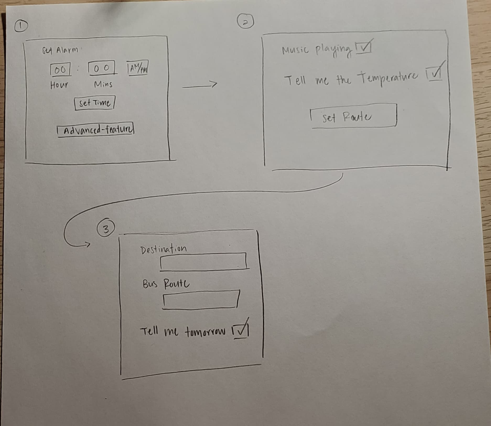
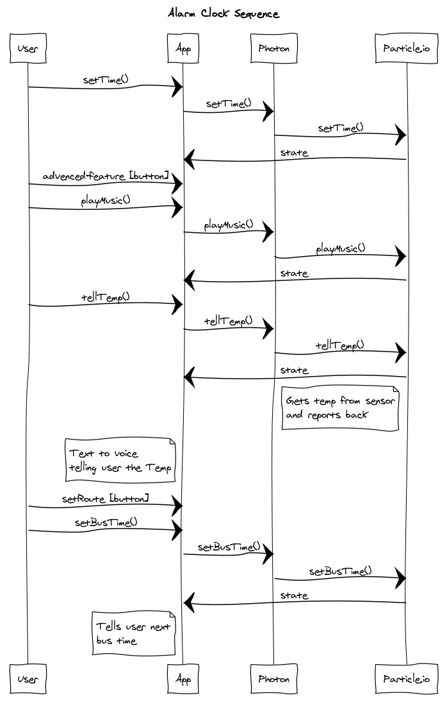

# 1. Description
Our IoT device is essentially a smart alarm clock. The user can set a time for the alarm to go off and perform some functionalities. Functionalities include
music playing that's represented by an LED, listening to the current temperature read from the temperature sensor, and announcing the next bus time.
# 2. Hardware and Cloud Infrastructure Needed
Temperature sensor,
Photon Kit
## Hardware:
Temperature sensor,
Photon Kit
## Cloud Infrastructure:
Using Google's text to voice, we can have it read the temperature read in from the temperature sensor.
# 3. Unknowns and Challenges
We may run into issues with the implementation, because we're not entirely familiar with how text to voice works. We would also like to
add some features if time permits. Like recommending what type of clothes should be worn based on temperature.
# 4. User Stories & Usage Scenarios
User can set a time for alarm to go off and perform functions.
  1. If snoozed,
  - User can set for music to start playing after alarm goes off.
    - LED will be used to represent the music playing.
    - If snoozed more than once, LED will appear to "breath" harder representing louder music.
  2. Alarm is turned off,
  - User can hear the current temperature aloud when alarm goes off.
  - User can set what route they want to take the next morning.
    - UI will announce aloud the next bus that's coming.
# 5. Paper Prototypes

# 6. Implementation: Sequence Diagrams

# 7. Plan and Schedule

## Weekly Schedule / Progress

| Week End     | Deliverables & Accomplishments |
|:-------------|:-------------------------------|
| By Nov 16    |  Basic functionality and wiring done for the project.                              |
| By Nov. 23   |  demo-able project to start user testing                     |
| By Nov. 30   |  User documentation.       |
| Dec. 3       |  Complete Project Due!         |

## Group Member Responsibilities (Groups only)

| Name         | Responsibilities |
|:-------------|:-----------------|
|      Minh Vu        |    Makes sure all of the functions are completed and working properly.              |
|       Sandra Xu       |   Makes base of project, help with coding parts, do user documentation.               |

## Times Reserved for Project Work

Fill in a schedule of times reserved for the project.  If you can't set regular weekly times, create a schedule based on specific days.

| Week Day | Times | Who (if on a team) |
|:---------|:------|--------------------|
| Monday   |    6pm-7pm    |          Minh, Sandra          |
| Tuesday  |   3pm-4pm    |          Sandra          |
| Wednesday|    6pm-8pm    |         Minh, Sandra           |
| Thursday |       |                    |
| Friday   |    4pm-6pm   |         Minh          |
| Saturday |       |                    |
| Sunday   |   6pm-8pm    |         Minh, Sandra           |
